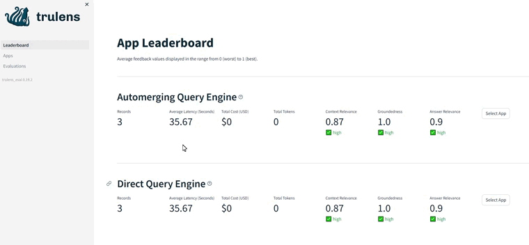

# TruLens Evaluation for LLM/RAG 🔎

## Overview

📓 Welcome to the TruLens Evaluation Notebook for LLM/RAG! This notebook explores advanced RAG (Retrieval-Augmented Generation) methods using Direct Query as a baseline and compares them to sentence-window and automerging-retrieval methods.

## Setup

Instead of relying on OpenAI models, this notebook uses Ollama 🦙 to install various models locally. This allows users without access to OpenAI to run the notebook seamlessly. We recommend running this notebook using Google Colab, which provides free access to T4 GPU compute for efficient execution. 🖥️

- **Introduction:** Overview of the notebook's purpose and objectives.
- **Setup:** Steps to install Ollama and import required libraries.
- **Advanced RAG** Comparison of advanced RAG methods with Direct Query, sentence-window, and automerging-retrieval methods.
- **Evaluation:** Utilizing TruLens🐙 to evaluate and compare context relevance, answer relevance, and groundedness.

## Running the Notebook

1. Open the notebook in Google Colab.
2. Execute each cell sequentially to ensure proper dependencies are installed.
3. Explore and run code cells to compare advanced RAG methods.
4. Evaluate results using TruLens🐙 metrics.

## Trulens Evaluation Metrics

To assess the quality of responses and context retrieved from different methods, this notebook utilizes TruLens🐙 to explore a Triad of metrics:

1. **Context Relevance:** Measures the relevance of the context to the query.
2. **Answer Relevance:** Evaluates how relevant the answer is to the query.
3. **Groundedness:** Assesses how well the answer is grounded in the provided context.

Feel free to customize and extend this notebook based on your specific needs. Happy evaluating! 🚀